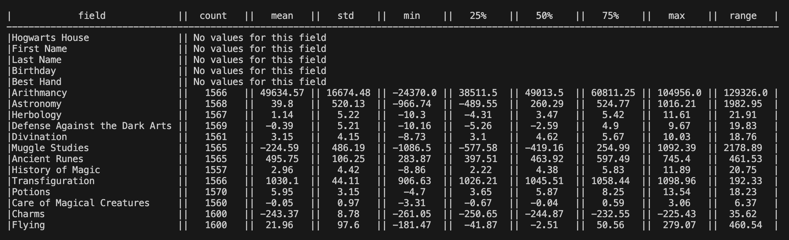
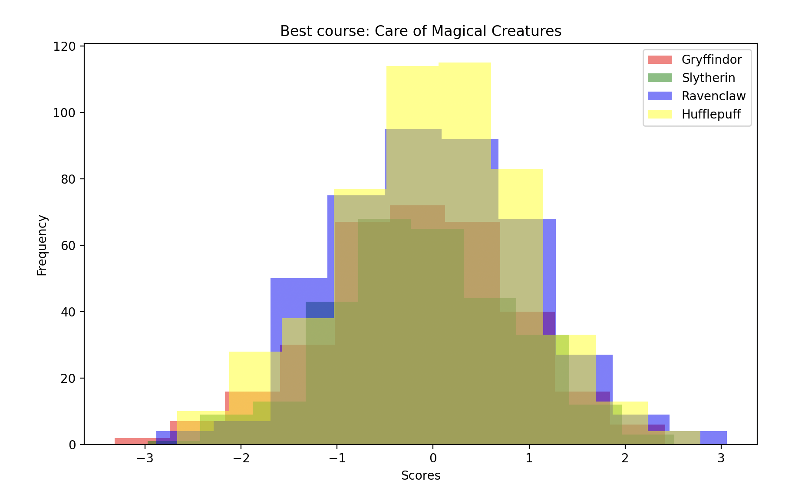
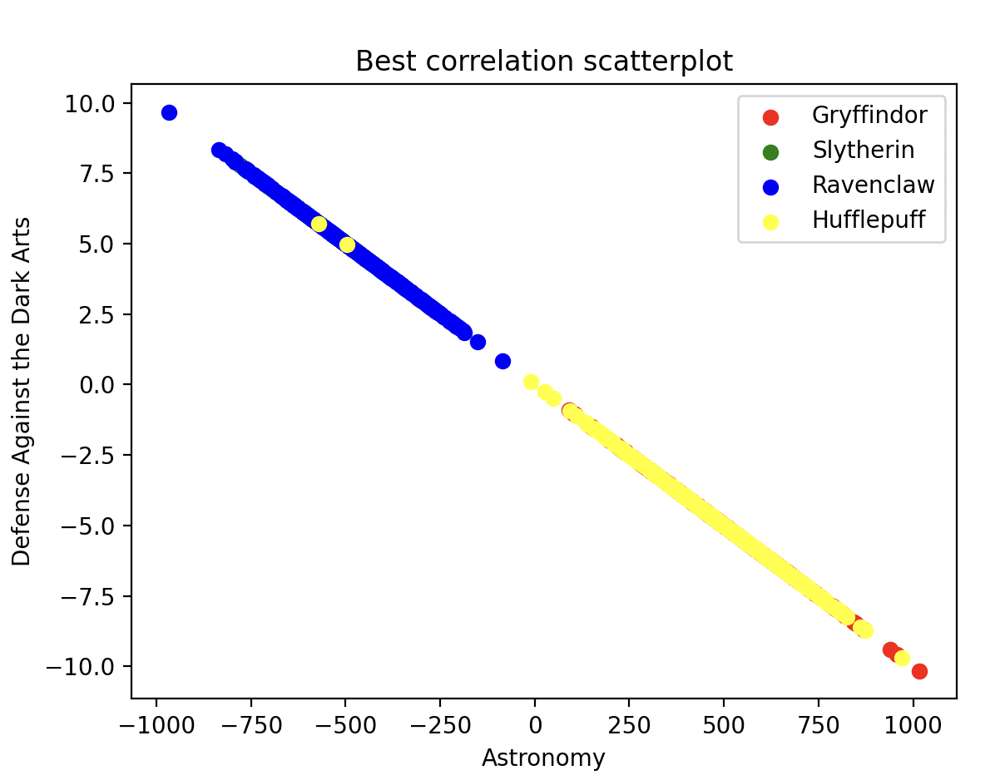
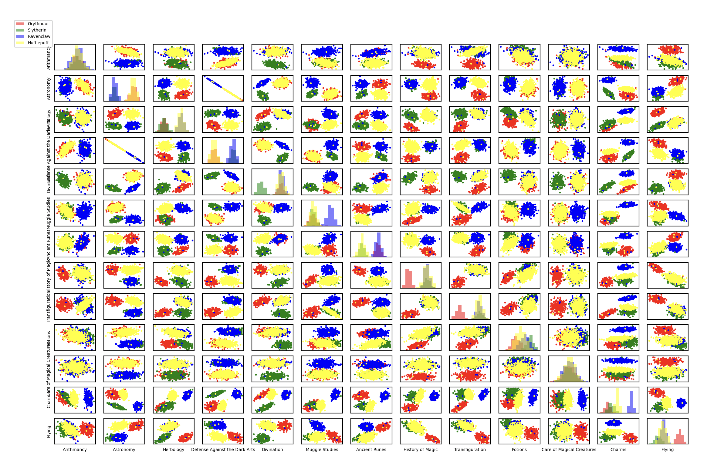

## Overview
A machine learning project that trains a logistic regression model to sort students into Hogwarts houses based on their course scores.

## Data Analysis

### Describe
Calculate and display key statistics for each course:
- **Mean**: Average score
- **Standard Deviation**: Measures spread of data around the mean
- **Percentiles**: Shows what percentage of data points are below a value.

### Histogram
Visualize score distributions to identify homogeneous courses:
- Groups numerical data into ranges
- Shows frequency of scores in each range

### Scatter Plot
Identify correlated courses:
- Plot pairs of courses to find relationships
- Calculate correlation coefficients to compare similarities

### Pair Plot
Combined visualization showing:
- Histograms on the diagonal
- Scatter plots for all course combinations

## Logistic Regression

### What is Logistic Regression?
Logistic regression predicts the probability that something belongs to a specific category (classification), unlike linear regression which predicts continuous values.

### One-vs-All Approach
The model trains 4 separate binary classifiers:
1. **Gryffindor classifier**: "Is this student Gryffindor? YES/NO"
2. **Slytherin classifier**: "Is this student Slytherin? YES/NO"
3. **Ravenclaw classifier**: "Is this student Ravenclaw? YES/NO"
4. **Hufflepuff classifier**: "Is this student Hufflepuff? YES/NO"

The student is assigned to whichever house has the highest predicted probability.

## Training Process

### 1. Feature Selection
Choose relevant courses based on data analysis:
- Exclude courses with homogeneous distributions, as there are no correlation with houses (the answer from the histogram part)
- Remove redundant courses that are highly correlated with others (the answer from the scatterplot part)

### 2. Data Normalization
Normalize all scores using: `(score - mean) / std`

**Why normalize?**
- Different courses have different score ranges (e.g. Muggle Studies: 0-100, Herbology: 0-10)
- Without normalization, weights become unbalanced
- Ensures all features contribute equally during training

### 3. Model Training
For each house:

**3a. Initialize weights** (θ₀, θ₁, θ₂, ...):
- Start with all weights set to 0

**3b. Calculate confidence** using sigmoid function:
```
z = θ₀ + θ₁·x₁ + θ₂·x₂ + ...
h = 1 / (1 + e^(-z))
```
Where h is the predicted probability (0 to 1)

**3c. Calculate cost** (loss function):
```
J = -(1/m) Σ [y·log(h) + (1-y)·log(1-h)]
```
Where:
- m = number of students
- y = actual label (1 if student belongs to this house, else 0)
- h = predicted confidence

**3d. Update weights** using gradient descent:
```
New weight = Old weight - (Learning rate × Gradient)
```
The gradient tells us which direction reduces the cost, so we subtract it to move towards the minimum.
Learning rate controls the step size

### 4. Iterations
Repeat the training process for a set number of iterations until the model converges.

### 5. Save Model
Export trained weights to `params.json` for later predictions.

## Prediction

1. Load trained weights from `params.json`
2. Extract and normalize student scores (using same mean/std from training)
3. Calculate confidence for each house
4. Assign student to house with highest confidence

## Bonus:

### Describe extra field
Extra field (Range) is added to the describe table

### Gradient Descent Methods

Three training modes are supported:

**Batch Gradient Descent (BGD)**
- Uses all training data for each weight update
- Most stable but slowest

**Mini-batch Gradient Descent (MBGD)**
- Uses batches of samples
- Balance between speed and stability

**Stochastic Gradient Descent (SGD)**
- Updates weights after each student
- Fastest but noisiest

## Results

### Describe


### Histogram


### Scatterplot


### Pairplot


